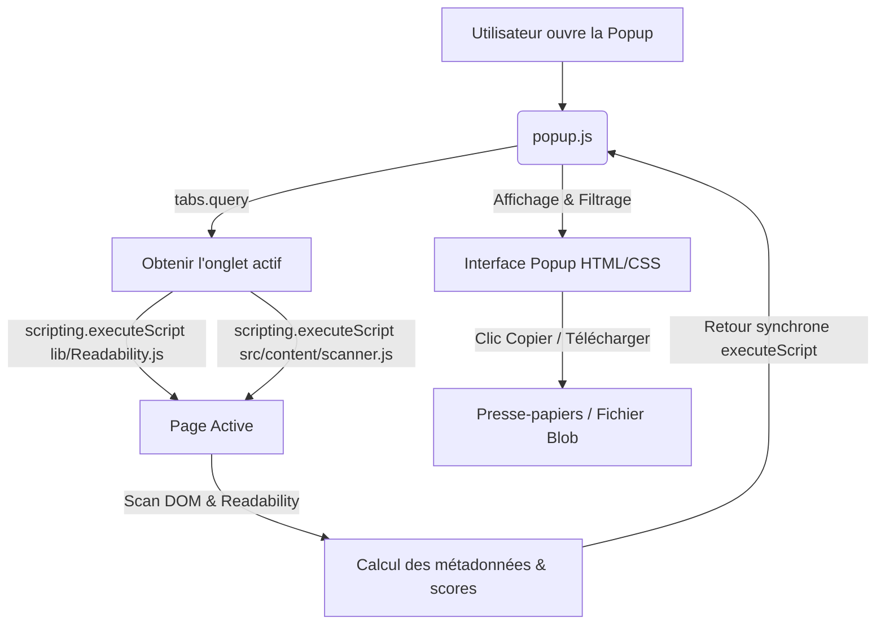

# 🏗️ Architecture Technique — Magic Links

Ce document détaille l'organisation interne de l'extension **Magic Links**, son cycle de vie, ses composants et les flux de données.

---

## 1. Vue d'Ensemble

L'extension fonctionne de manière entièrement locale, côté client, sans aucun service d'arrière-plan permanent ni stockage persistant complexe. L'architecture repose sur l'injection dynamique d'un script de scan (Content Script) dans l'onglet actif au moment où l'utilisateur ouvre la popup.

---

## 2. Contextes d'Exécution et Composants

### 2.1 Contexte Extension (Popup UI)
- **`src/popup/popup.html`** & **`src/popup/popup.css`** : Représentent l'interface graphique de l'extension. Elle est stylisée en Glassmorphism pour offrir une esthétique moderne et premium. Elle s'adapte aux interactions tactiles (taille >= 44px).
- **`src/popup/popup.js`** : Contrôleur principal. Il orchestre l'injection de scripts dans l'onglet actif, reçoit la liste des liens extraits, applique les filtres en temps réel (Fast Research, Toggle de mode, Regroupement par domaine) et gère la mise en forme pour les exports.

### 2.2 Contexte Page Active (DOM)
- **`lib/Readability.js`** : Librairie de parsing de Mozilla qui extrait le conteneur principal (l'article) du DOM. C'est elle qui permet d'identifier si un lien se trouve dans le "Contenu principal".
- **`src/content/scanner.js`** : Script injecté dynamiquement. Il s'exécute dans le bac à sable de la page active. Il extrait tous les éléments `<a>`, applique les règles de nettoyage de base, calcule le score de pertinence, et évalue si les liens appartiennent au corps extrait par `Readability`.
- **Sécurité et Isolation (World)** : Les scripts injectés via `browser.scripting.executeScript` s'exécutent par défaut dans le monde isolé (`ISOLATED` world) de Firefox. Ils partagent le DOM avec la page hôte mais possèdent un espace global JavaScript distinct. Cela garantit que les scripts tiers de la page ne peuvent pas lire, modifier ou détourner l'exécution de `scanner.js`, assurant la robustesse face aux injections de code.

### 2.3 Partagé et Utilitaires
- **`src/shared/utils.js`** : Regroupe les méthodes d'extraction de domaine, les échappements de caractères spécifiques pour le CSV et le Markdown, ainsi que le système d'i18n.
- **`_locales/`** : Répertoires de traduction supportant 7 langues (`en`, `fr`, `de`, `es`, `vi`, `ja`, `pt`).

---

## 3. Flux de Traitement des Liens

### 3.1 Dédoublonnage et Nettoyage
1. **Filtrage des schémas** : Exclusion immédiate de tout lien n'ayant pas un protocole `http:` ou `https:`.
2. **Normalisation** : Suppression du fragment de lien (ancre `#`) pour regrouper les liens pointant vers la même ressource.
3. **Dédoublonnage** : Si plusieurs liens pointent vers la même URL absolue :
   - On ne conserve qu'une seule entrée.
   - On garde le premier titre descriptif trouvé (ou le plus long textuellement).

### 3.2 Algorithme de Scoring
Chaque lien se voit attribuer un score de pertinence numérique pour trier les listes :
* **Base** : `isContent === true` (dans l'article principal) ➔ **+50 pts**.
* **Qualité du texte d'ancre** :
  - Si l'ancre est vide ou correspond exactement à l'URL : **-30 pts** (faible valeur ajoutée).
  - Sinon : **+1 pt** par caractère ou mot descriptif (plafonné à **+20 pts**).
* **Contexte externe** :
  - Lien externe (vers un autre domaine que l'hôte) : **+10 pts** (souvent une source ou référence intéressante).
